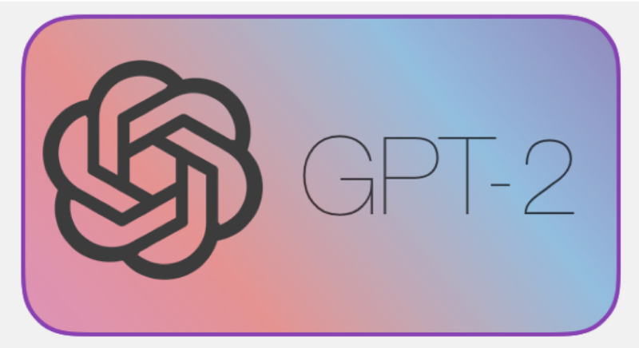

# GPT-2 Training Script



This repository contains a PyTorch implementation for training and fine-tuning GPT-2 models. The main script `train_gpt2.py` provides functionality for training GPT-2 models with various configurations and supports both single-GPU and distributed training setups.


### Simple Launch (Single GPU)
```bash
python train_gpt2.py
```

### Distributed Training (Multiple GPUs)
```bash
torchrun --standalone --nproc_per_node=8 train_gpt2.py
```

## Training Parameters

- Learning Rate: 6e-4
- Weight Decay: 0.1
- Block Size: 1024
- Vocabulary Size: 50,257 (GPT-2 tokenizer)


## License

This project is part of the build-nanogpt repository.